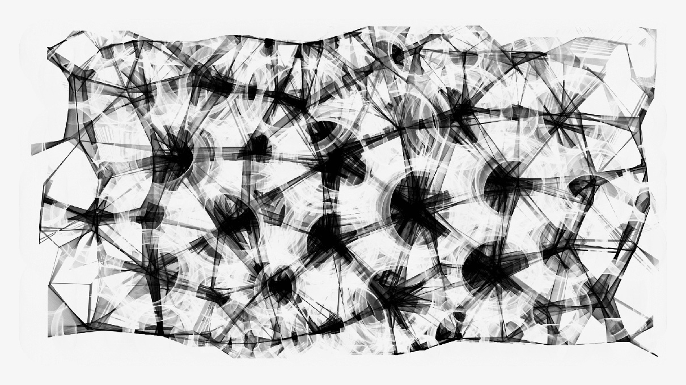
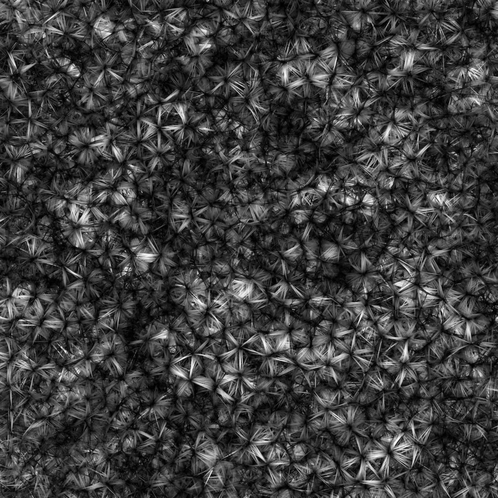

# rzha8378_9103_tut4_Quiz8

# Part 1: Imaging Technique Inspiration

## Inspiration: Casey Reas - “Process Series”

### Casey Reas' “Process Series” uses simple shapes to generate complex visuals through recursion. I will define some basic graphic elements like lines or circles and set rules for their growth, such as direction, speed, transparency, and other attributes. By using recursive functions and conditional logic, these elements will interact and gradually accumulate into complex patterns. This technique is able to represent the evolution from simple rules to complex structures and is perfect for data visualization and dynamic art creation.

## Visual Examples
  

  

# Part 2: Coding Technique Exploration

## Coding Technique: Circle Intersection and Motion with Multiple Objects

### This code simulates 100 circles of varying sizes and speeds moving independently. The move() function updates their positions, and the update() function checks for intersections with other circles. The intersect() function detects and visualizes intersections, creating dynamic patterns as circles interact. This approach demonstrates how simple geometric rules can generate complex, emergent behaviors, similar to Casey Reas' “Process Series.” It effectively showcases dynamic interactions and layered structures using basic shapes, making it ideal for visualizing complex systems or creating generative art.

  

## Code Examples
https://github.com/REAS/SoftwareStructures/blob/master/Code-2016/S3_Process_09/S3_Process_09.pde
