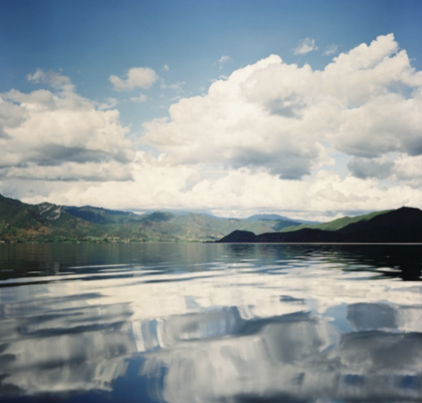

# Individual animation content
# Personal animation interaction method:
Animation of clouds and reflections of buildings in the water: part of the animation will start automatically when the page is loaded.
Clicking on the sky: clicking on the sky triggers a sunset interaction, where the sun moves along a trajectory arc.
I chooice Time-Based:Employ timers and events for animation.
# Methods and details of personal animation realization:
Building reflection animation: add a slight swaying animation to the building reflection to imitate the reflection in the water moving with the wind.
Clouds in the sky: the clouds are animated to float horizontally to simulate the movement of clouds in the natural sky.
The sun: clicking on the sky triggers a sunset, and the sun moves in an arc to increase the interactivity and interest of the animation.

Animation is characterized by the fact that they work together to form a whole picture effect, as a set of coherent environmental effects presented in the picture, simulating the dynamic sense of wind and water in nature.

# Animation Inspiration: 
  
The animation is inspired by landscape photographic images that show the dynamic feel of the water and the shapes of the clouds that I have added to my own work.

